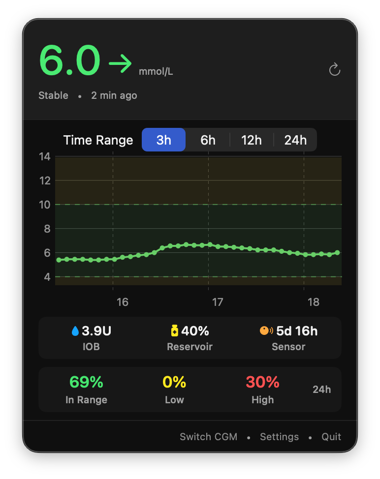

# GlucoBar

A macOS menu bar app that displays real-time blood glucose readings from your CGM sensor. Supports **Dexcom**, **Medtronic CareLink**, and **FreeStyle Libre**.

## Features

- **Real-time glucose display** in the menu bar (e.g., "6.0 →")
- **Multiple CGM sources**: Dexcom Share, Medtronic CareLink, FreeStyle Libre
- **Trend arrows** showing glucose direction (↑↑, ↑, ↗, →, ↘, ↓, ↓↓)
- **Color-coded values**:
  - 🟢 Green: In range (4.0-10.0 mmol/L)
  - 🟡 Yellow: Warning (3.3-4.0 or 10.0-13.9 mmol/L)
  - 🔴 Red: Urgent (<3.3 or >13.9 mmol/L)
- **Glucose graph** with selectable time range (3h, 6h, 12h, 24h)
- **Medtronic pump status** — IOB, reservoir level, battery, and sensor age (CareLink only)
- **24-hour Time in Range** stats
- **Launch at Login** option
- **Automatic refresh** every 5 minutes

## Requirements

- macOS 14.0 (Sonoma) or later
- A supported CGM sensor:
  - **Dexcom** (G6, G7, ONE, ONE+) with Dexcom Share enabled
  - **Medtronic** (Guardian, 780G, 770G) via CareLink
  - **FreeStyle Libre** (Libre 2, Libre 3) via LibreLinkUp

## Installation

### Option 1: Download Release
Download the latest `GlucoBar.app` from the [Releases](../../releases) page.

### Option 2: Build from Source
1. Clone this repository
2. Open `GlucoBar/GlucoBar.xcodeproj` in Xcode
3. Build and run (⌘R)

## Setup

1. Launch GlucoBar
2. Click the `---` in your menu bar
3. Choose your CGM source (Dexcom, Medtronic CareLink, or FreeStyle Libre)
4. Enter your credentials and connect

### Dexcom
- Enter your Dexcom account email/phone and password
- Select your region (US or Non-US)
- Use the account that **has the CGM sensor**, not a follower account
- Dexcom Share must be enabled with at least one follower

### Medtronic CareLink
- Enter your CareLink username and select your region
- Sign in via the browser-based OAuth flow
- Works with both patient and care partner accounts

### FreeStyle Libre
- Enter your LibreLinkUp email and password
- Region is auto-detected

## Privacy

- Your credentials are stored securely in the macOS Keychain
- No data is sent anywhere except to your CGM provider's servers
- The app runs entirely locally on your Mac

## Troubleshooting

**"Invalid credentials" error**
- Make sure you're using the correct account credentials
- For Dexcom: try logging into [share.dexcom.com](https://share.dexcom.com) to verify

**"No data available"**
- Check that your CGM sensor is active and transmitting
- For Dexcom: verify Share is enabled with at least one follower

**App shows "---"**
- The app is still loading or waiting for data
- Click the refresh button to manually fetch readings

## License

MIT License - feel free to use, modify, and distribute.

## Disclaimer

This app is not affiliated with or endorsed by Dexcom, Medtronic, or Abbott. It uses unofficial APIs that may change without notice. Use at your own risk and always verify glucose readings with your official CGM app or a blood glucose meter for medical decisions.

## Contributing

Contributions are welcome! Please feel free to submit issues and pull requests.
